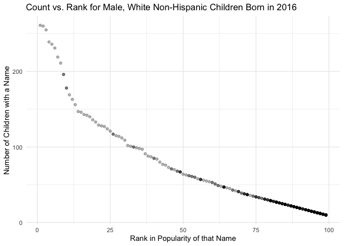

Homework 2
================

``` r
library(tidyverse)
```

    ## ── Attaching packages ─────────────────────────────────────── tidyverse 1.3.1 ──

    ## ✓ ggplot2 3.3.5     ✓ purrr   0.3.4
    ## ✓ tibble  3.1.4     ✓ dplyr   1.0.7
    ## ✓ tidyr   1.1.4     ✓ stringr 1.4.0
    ## ✓ readr   2.0.2     ✓ forcats 0.5.1

    ## ── Conflicts ────────────────────────────────────────── tidyverse_conflicts() ──
    ## x dplyr::filter() masks stats::filter()
    ## x dplyr::lag()    masks stats::lag()

``` r
library(readxl)
library(dplyr)
library(ggplot2)
```

# Problem 1

## Mr. Trash Wheel Dataset

Reading the Mr. Trash Wheel dataset, and cleaning it by specifying the
sheet, omitting non-data entries, changing variable names, omitting rows
that do not include dumpster-specific data, and rounding the number of
sports balls to the nearest integer.

``` r
trash_wheel = read_excel("./data/Trash-Wheel-Collection-Totals-7-2020-2.xlsx", 
                         range = "A2:N535", 
                         "Mr. Trash Wheel") %>% 
  na.omit("Dumpster") %>% 
  janitor::clean_names() %>% 
  mutate(sports_balls = round(as.numeric(sports_balls)))

head(trash_wheel) %>% 
  knitr::kable()
```

| dumpster | month | year | date       | weight_tons | volume_cubic_yards | plastic_bottles | polystyrene | cigarette_butts | glass_bottles | grocery_bags | chip_bags | sports_balls | homes_powered |
|:---------|:------|-----:|:-----------|------------:|-------------------:|----------------:|------------:|----------------:|--------------:|-------------:|----------:|-------------:|--------------:|
| 1        | May   | 2014 | 2014-05-16 |        4.31 |                 18 |            1450 |        1820 |          126000 |            72 |          584 |      1162 |            7 |             0 |
| 2        | May   | 2014 | 2014-05-16 |        2.74 |                 13 |            1120 |        1030 |           91000 |            42 |          496 |       874 |            5 |             0 |
| 3        | May   | 2014 | 2014-05-16 |        3.45 |                 15 |            2450 |        3100 |          105000 |            50 |         1080 |      2032 |            6 |             0 |
| 4        | May   | 2014 | 2014-05-17 |        3.10 |                 15 |            2380 |        2730 |          100000 |            52 |          896 |      1971 |            6 |             0 |
| 5        | May   | 2014 | 2014-05-17 |        4.06 |                 18 |             980 |         870 |          120000 |            72 |          368 |       753 |            7 |             0 |
| 6        | May   | 2014 | 2014-05-20 |        2.71 |                 13 |            1430 |        2140 |           90000 |            46 |          672 |      1144 |            5 |             0 |

The above table is a 6-row preview of the cleaned Mr. Trash Wheel
dataset.

## Precipitation Datasets

Reading and cleaning the precipitation data for 2018 and 2019 through
omitting rows without precipitation data, adding a `year` variable,
combining precipitation datasets and converting month to a character
variable.

``` r
precipitation_2018 = read_excel("./data/Trash-Wheel-Collection-Totals-7-2020-2.xlsx", 
                         range = "A2:B14", 
                         "2018 Precipitation") %>% 
  mutate(year = "2018")

precipitation_2019 = read_excel("./data/Trash-Wheel-Collection-Totals-7-2020-2.xlsx", 
                         range = "A2:B14", 
                         "2019 Precipitation") %>% 
  mutate(year = "2019")

precipitation =
  bind_rows(precipitation_2018, precipitation_2019) %>% 
  janitor::clean_names() %>% 
  mutate(month = month.name[month])

head(precipitation) %>% 
  knitr::kable()
```

| month    | total | year |
|:---------|------:|:-----|
| January  |  0.94 | 2018 |
| February |  4.80 | 2018 |
| March    |  2.69 | 2018 |
| April    |  4.69 | 2018 |
| May      |  9.27 | 2018 |
| June     |  4.77 | 2018 |

The trash wheel dataset has 453 observations and 14 variables, and key
variables are dumpster, month, year, date, weight_tons,
volume_cubic_yards, plastic_bottles, polystyrene, cigarette_butts,
glass_bottles, grocery_bags, chip_bags, sports_balls, homes_powered. The
median number of sports balls in a dumpster in 2019 was 9 balls.

The precipitation dataset has 24 observations, and key variables are
month, total, year. The precipitation data ranges from 0.16 to 10.47.
The total precipitation in 2018 was 70.33.

# Problem 2

## pols-month Dataset

Clean the data in pols-month.csv through breaking up the variable mon
into year, month, and day, replacing month number with month name,
creating a president variable.

``` r
pols_month = 
  read_csv("./data/fivethirtyeight_datasets/pols-month.csv") %>% 
  janitor::clean_names() %>% 
  separate(mon, into = c("year", "month", "day")) %>% 
  mutate(year = as.integer(year), month = as.integer(month), day = as.integer(day)) %>% 
  mutate(month = month.name[as.numeric(month)]) %>% 
  mutate(president = ifelse(prez_gop == 1, "gop", "dem")) %>% 
  select(-"day", -"prez_gop", -"prez_dem") %>% 
  select(year, month, everything()) %>% 
  mutate(year = as.numeric(year)) 
```

    ## Rows: 822 Columns: 9

    ## ── Column specification ────────────────────────────────────────────────────────
    ## Delimiter: ","
    ## dbl  (8): prez_gop, gov_gop, sen_gop, rep_gop, prez_dem, gov_dem, sen_dem, r...
    ## date (1): mon

    ## 
    ## ℹ Use `spec()` to retrieve the full column specification for this data.
    ## ℹ Specify the column types or set `show_col_types = FALSE` to quiet this message.

``` r
head(pols_month) %>% 
  knitr::kable()
```

| year | month    | gov_gop | sen_gop | rep_gop | gov_dem | sen_dem | rep_dem | president |
|-----:|:---------|--------:|--------:|--------:|--------:|--------:|--------:|:----------|
| 1947 | January  |      23 |      51 |     253 |      23 |      45 |     198 | dem       |
| 1947 | February |      23 |      51 |     253 |      23 |      45 |     198 | dem       |
| 1947 | March    |      23 |      51 |     253 |      23 |      45 |     198 | dem       |
| 1947 | April    |      23 |      51 |     253 |      23 |      45 |     198 | dem       |
| 1947 | May      |      23 |      51 |     253 |      23 |      45 |     198 | dem       |
| 1947 | June     |      23 |      51 |     253 |      23 |      45 |     198 | dem       |

## snp Dataset

Cleaning the data in snp.csv by breaking up the variable date into year,
month, and day, and replacing month number with month name.

``` r
snp = 
  read_csv("./data/fivethirtyeight_datasets/snp.csv") %>% 
  janitor::clean_names() %>% 
  mutate(date, date = lubridate::mdy(date)) %>% 
  separate(date, into = c("year", "month", "day")) %>% 
  mutate(year = as.numeric(year)) %>% 
  mutate(year = ifelse(year > 2049, year - 100, year)) %>% 
  mutate(month = month.name[as.numeric(month)]) %>% 
  arrange(year, month) %>% 
  select(year, month, everything()) %>% 
  select(-"day")
```

    ## Rows: 787 Columns: 2

    ## ── Column specification ────────────────────────────────────────────────────────
    ## Delimiter: ","
    ## chr (1): date
    ## dbl (1): close

    ## 
    ## ℹ Use `spec()` to retrieve the full column specification for this data.
    ## ℹ Specify the column types or set `show_col_types = FALSE` to quiet this message.

``` r
head(snp) %>% 
  knitr::kable()
```

| year | month    | close |
|-----:|:---------|------:|
| 1950 | April    | 17.96 |
| 1950 | August   | 18.42 |
| 1950 | December | 20.43 |
| 1950 | February | 17.22 |
| 1950 | January  | 17.05 |
| 1950 | July     | 17.84 |

## Unemployment Data

Cleaning the unemployment data so that it has the same names of the key
variables, and ensuring that key variables month and year take the same
values.

``` r
unemployment = 
  read_csv("./data/fivethirtyeight_datasets/unemployment.csv") %>% 
  pivot_longer(Jan:Dec,
               names_to = "month",
               values_to = "unemployment") %>% 
  janitor::clean_names() %>% 
  mutate(month = month.name[match(month, month.abb)]) %>% 
  arrange(year, month)%>% 
  mutate(year = as.numeric(year)) 
```

    ## Rows: 68 Columns: 13

    ## ── Column specification ────────────────────────────────────────────────────────
    ## Delimiter: ","
    ## dbl (13): Year, Jan, Feb, Mar, Apr, May, Jun, Jul, Aug, Sep, Oct, Nov, Dec

    ## 
    ## ℹ Use `spec()` to retrieve the full column specification for this data.
    ## ℹ Specify the column types or set `show_col_types = FALSE` to quiet this message.

``` r
head(unemployment) %>% 
  knitr::kable()
```

| year | month    | unemployment |
|-----:|:---------|-------------:|
| 1948 | April    |          3.9 |
| 1948 | August   |          3.9 |
| 1948 | December |          4.0 |
| 1948 | February |          3.8 |
| 1948 | January  |          3.4 |
| 1948 | July     |          3.6 |

## Joining Datasets

Merging snp into pols, and merging unemployment into the resulting
dataframe.

``` r
snp_pols = left_join(pols_month, snp, by = c("year", "month"))

merge_df = left_join(snp_pols, unemployment, by = c("year", "month"))

head(merge_df) %>% 
  knitr::kable()
```

| year | month    | gov_gop | sen_gop | rep_gop | gov_dem | sen_dem | rep_dem | president | close | unemployment |
|-----:|:---------|--------:|--------:|--------:|--------:|--------:|--------:|:----------|------:|-------------:|
| 1947 | January  |      23 |      51 |     253 |      23 |      45 |     198 | dem       |    NA |           NA |
| 1947 | February |      23 |      51 |     253 |      23 |      45 |     198 | dem       |    NA |           NA |
| 1947 | March    |      23 |      51 |     253 |      23 |      45 |     198 | dem       |    NA |           NA |
| 1947 | April    |      23 |      51 |     253 |      23 |      45 |     198 | dem       |    NA |           NA |
| 1947 | May      |      23 |      51 |     253 |      23 |      45 |     198 | dem       |    NA |           NA |
| 1947 | June     |      23 |      51 |     253 |      23 |      45 |     198 | dem       |    NA |           NA |

The `pols-month.csv` dataset has 822 observations and 9 variables
related to the number of national politicians who are democratic or
republican. Variables include year, month, gov_gop, sen_gop, rep_gop,
gov_dem, sen_dem, rep_dem, president. The year ranges from 1947 to 2015.
The new `president` column indicates that whether the president was
republican or democratic on the associated date.

The `snp.csv` dataset has 787 observations and 3 variables related to
Standard & Poor’s stock market index. Variables include year, month,
close. The year ranges from 1950 to 2015.

The `unemployment.csv` dataset has 816 observations and 3 variables of
the percentages of unemployment. Variables include year, month,
unemployment. The year ranges from 1948 to 2015.

The resulting final dataset has 822 observations and 11 variables.
Variables include year, month, gov_gop, sen_gop, rep_gop, gov_dem,
sen_dem, rep_dem, president, close, unemployment. The year ranges from
1947 to 2015.

# Problem 3

## Tidying

Load and tidy the data by changing names in the ethnicity column,
changing the case structure in the child’s first name column, and
removing duplicated rows.

``` r
names = 
  read_csv("./data/Popular_Baby_Names.csv") %>% 
  janitor::clean_names() %>% 
  mutate(ethnicity = str_to_lower(ethnicity), gender = str_to_lower(gender)) %>%
  mutate(ethnicity = recode(ethnicity, "asian and paci" = "asian and pacific islander", "black non hisp" = "black non hispanic", "white non hisp" = "white non hispanic")) %>% 
  mutate(childs_first_name = str_to_title(childs_first_name)) %>% 
  distinct()
```

    ## Rows: 19418 Columns: 6

    ## ── Column specification ────────────────────────────────────────────────────────
    ## Delimiter: ","
    ## chr (3): Gender, Ethnicity, Child's First Name
    ## dbl (3): Year of Birth, Count, Rank

    ## 
    ## ℹ Use `spec()` to retrieve the full column specification for this data.
    ## ℹ Specify the column types or set `show_col_types = FALSE` to quiet this message.

``` r
head(names) %>% 
  knitr::kable()
```

| year_of_birth | gender | ethnicity                  | childs_first_name | count | rank |
|--------------:|:-------|:---------------------------|:------------------|------:|-----:|
|          2016 | female | asian and pacific islander | Olivia            |   172 |    1 |
|          2016 | female | asian and pacific islander | Chloe             |   112 |    2 |
|          2016 | female | asian and pacific islander | Sophia            |   104 |    3 |
|          2016 | female | asian and pacific islander | Emily             |    99 |    4 |
|          2016 | female | asian and pacific islander | Emma              |    99 |    4 |
|          2016 | female | asian and pacific islander | Mia               |    79 |    5 |

## Rank in Popularity of the Name “Olivia” Over Time

To show the popularity of “Olivia” over time, we need to create a
subtable from the original `names` dataset which only contains data
relating to the child’s first name “Olivia”. We also need to make it
into a wider dataframe which has rows for ethnicities and columns for
year in order to see the trend of ranks over time.

``` r
olivia = 
  names %>% 
  filter(childs_first_name == "Olivia") %>% 
  select(-"gender", -"childs_first_name", -"count") %>% 
  arrange(year_of_birth) %>% 
  pivot_wider(
    names_from = "year_of_birth", 
    values_from = "rank")

head(olivia) %>% 
  knitr::kable()
```

| ethnicity                  | 2011 | 2012 | 2013 | 2014 | 2015 | 2016 |
|:---------------------------|-----:|-----:|-----:|-----:|-----:|-----:|
| asian and pacific islander |    4 |    3 |    3 |    1 |    1 |    1 |
| black non hispanic         |   10 |    8 |    6 |    8 |    4 |    8 |
| hispanic                   |   18 |   22 |   22 |   16 |   16 |   13 |
| white non hispanic         |    2 |    4 |    1 |    1 |    1 |    1 |

## Most Popular Name Among Male Children Over Time

To show the most popular name among male children over time, we need to
create a sub-dataframe from the original `names` dataset, and it should
only contains data relating to all boy’s names ranking 1 in each
ethnicity group. We also need to make it into a wider dataframe which
has rows for ethnicity and columns for year in order to see the trend of
popular names over time.

``` r
popular =
  names %>% 
  filter(gender == "male", rank == "1") %>% 
  select(-"gender", -"count", -"rank") %>% 
  arrange(year_of_birth) %>% 
  pivot_wider(
    names_from = "year_of_birth",
    values_from = "childs_first_name"
  )

head(popular) %>% 
  knitr::kable()
```

| ethnicity                  | 2011    | 2012   | 2013   | 2014   | 2015   | 2016   |
|:---------------------------|:--------|:-------|:-------|:-------|:-------|:-------|
| asian and pacific islander | Ethan   | Ryan   | Jayden | Jayden | Jayden | Ethan  |
| black non hispanic         | Jayden  | Jayden | Ethan  | Ethan  | Noah   | Noah   |
| hispanic                   | Jayden  | Jayden | Jayden | Liam   | Liam   | Liam   |
| white non hispanic         | Michael | Joseph | David  | Joseph | David  | Joseph |

## Scatterplot for Male, White Non-hispanic Children Born in 2016

A sub-dataset is made by filtering for only male, 2016 and white
non-hispanic.

``` r
male_white_non_hispanic_2016 = 
  names %>% 
  filter(gender == "male", year_of_birth == "2016", ethnicity == "white non hispanic")

male_white_non_hispanic_2016 %>% 
  ggplot(aes(x = rank, y = count)) +
  geom_point(alpha = .3) +
  ggtitle("Count vs. Rank for Male, White Non-Hispanic Children Born in 2016") +
  xlab("Rank in Popularity of that Name") +
  ylab("Number of Children with a Name") +
  theme_minimal()
```

<!-- -->

``` r
ggsave("male_white_non_hispanic_2016.pdf")
```

    ## Saving 7 x 5 in image
